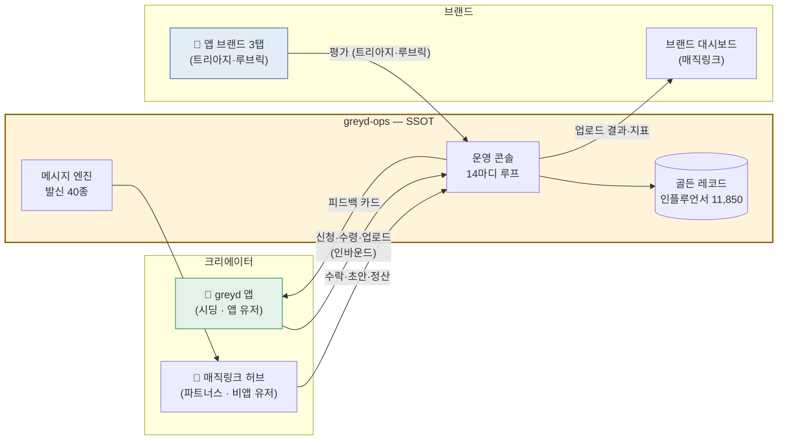
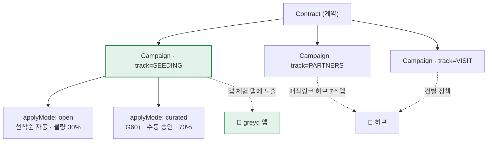
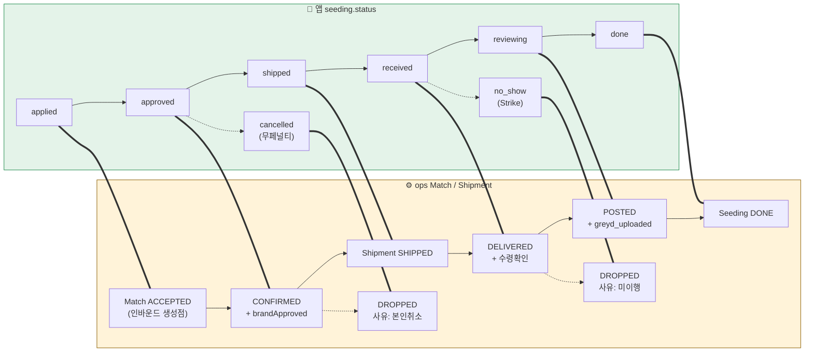
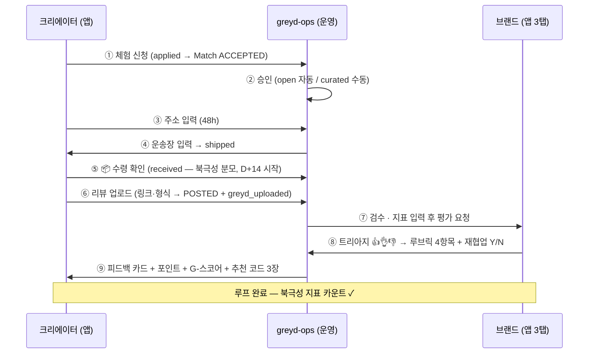
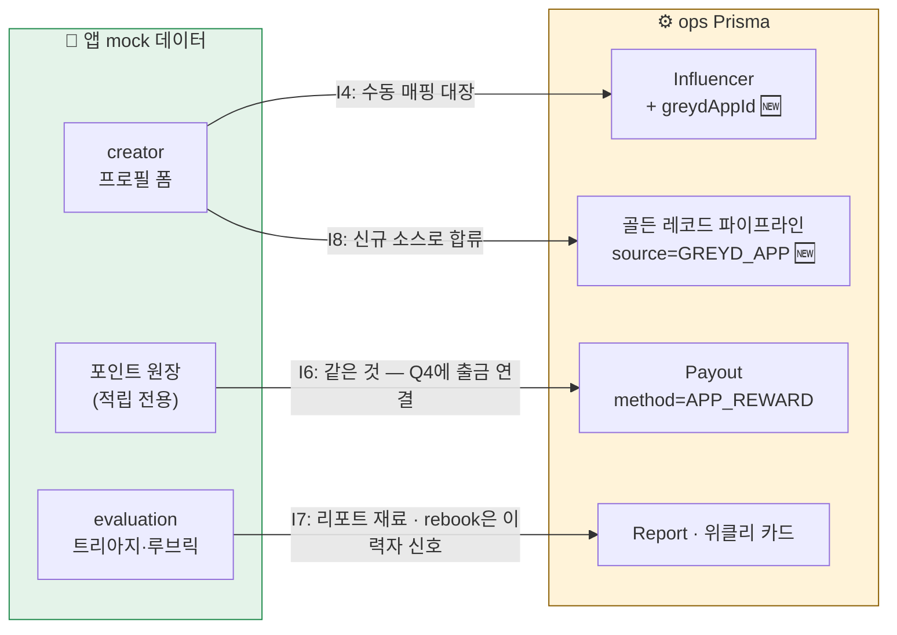
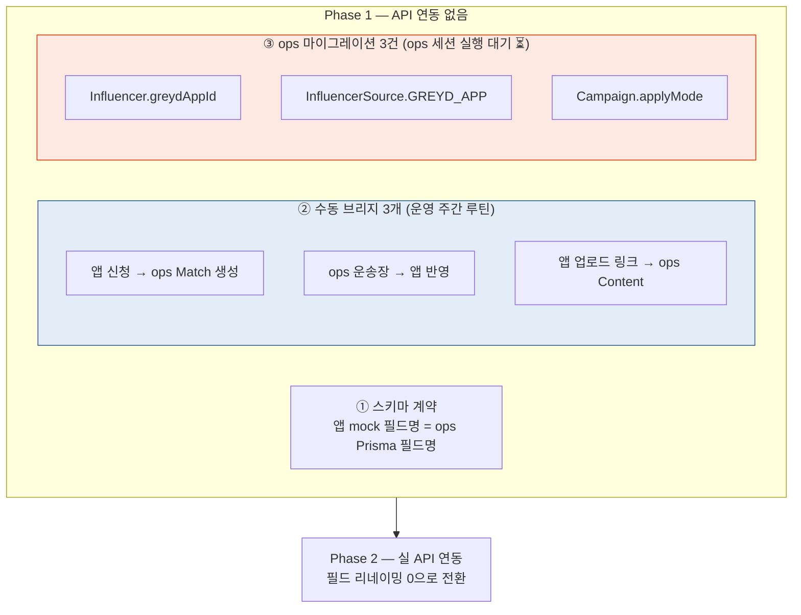

# greyd 앱 ↔ greyd-ops 얼라인 다이어그램

정본 문서: `2026-08-10-app-ops-integration.md` (I1~I10) — 이 문서는 그 시각화판이다.
원칙 한 줄: **비즈니스 상태의 정본은 greyd-ops. 앱은 SEEDING 트랙의 크리에이터 표면이다.**

---

## 1. 시스템 경계 — 누가 무엇의 정본인가

> 충돌 시 ops가 이긴다. 앱·허브·브랜드 화면은 전부 같은 ops 레코드의 투영.

---

## 2. 트랙 계층 — "체험"과 applyMode의 위치 (I1)

> "트랙"은 ops 예약어(상품 유형). 앱의 Open/Curated는 트랙이 아니라 **SEEDING 캠페인의 신청 유형(applyMode)**.

---

## 3. 상태머신 매핑 — 앱 8값 ↔ ops (I3)

> 앱 인바운드 신청은 ops에 Match를 **ACCEPTED로 생성**한다 — 크리에이터 의사가 이미 확보돼 섭외(OUTREACH·D3/D7 팔로업)를 통째로 생략. 이것이 앱의 존재 이유 중 하나.

---

## 4. 검증 루프 전체 시퀀스 — 세 시스템이 맞물리는 순서

---

## 5. 데이터 연결 — ID · 보상 · 평가의 흐름 (I4 · I6 · I7 · I8)

---

## 6. Phase 1 통합 스코프 — 실제로 연결하는 것 (I10)

---

## 결정 대기 4건 (양측 합의 필요)

| # | 쟁점 | 제안 |
|---|---|---|
| 1 | 시딩 Open 자동 승인 vs 브랜드 승인보드 충돌 | 캠페인 개설 시 브랜드가 "선착순 자동 승인" 사전 위임 |
| 2 | G-스코어를 ops 매칭 스코어 입력으로 쓸지 | 2단계 논의 |
| 3 | 배치 초대 메일 + 앱 초대 코드 동봉(성장 루프) 시작 시점 | Phase 1 후반, 첫 루프 완료 사례 확보 후 |
| 4 | greydAppId 매핑 UI 위치 | ops 초대 코드 관리 화면에 통합 |
