# greyd 앱 ↔ greyd-ops 얼라인 다이어그램

정본 문서: `2026-08-10-app-ops-integration.md` (I1~I11) — 이 문서는 그 시각화판이다.
원칙 한 줄: **비즈니스 상태의 정본은 greyd-ops. 앱은 SEEDING 트랙의 인플루언서 표면이다.**

---

## 0. 전체 그림 한 장 (2026-08-11 현재 — D24~D28 반영)

역할마다 표면이 정확히 하나씩이다: **인플루언서=앱 · 브랜드=웹 매직링크 · 운영=ops 콘솔.** 데이터의 정본은 전부 ops DB.

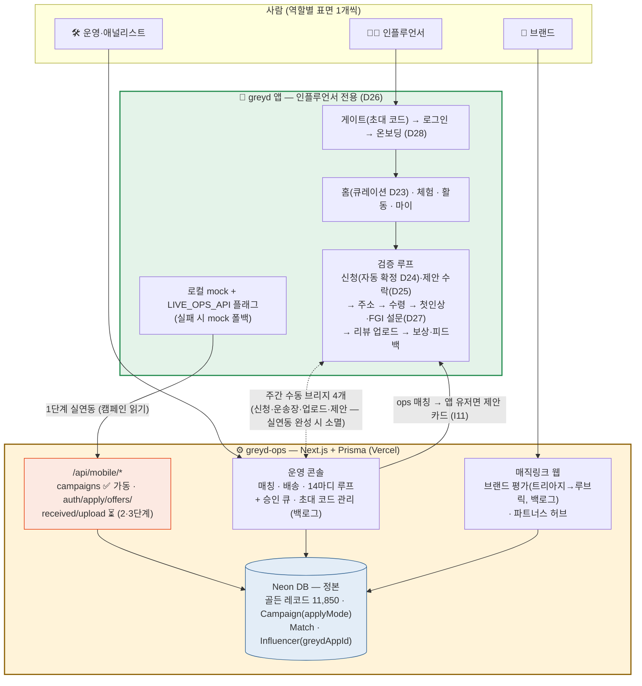

**현재 상태 요약**

| 영역 | 상태 |
|---|---|
| 앱 인플루언서 퍼널 (게이트→루프 전체) | ✅ 구현·에뮬레이터 검증 완료 (D1~D28) |
| ops 스키마 정합 (greydAppId·applyMode·GREYD_APP) | ✅ db push까지 완료 |
| 실연동 1단계 — 캠페인 목록 | ✅ ops 라우트 가동 + 앱 플래그·폴백 준비 (켜기만 하면 됨) |
| 실연동 2·3단계 — 신청·제안·수령·업로드·인증 | ⏳ 그때까지 주간 수동 브리지 4개 |
| 브랜드 평가 웹 · 콘솔 승인 큐 · 초대 코드 관리 | ⏳ ops 백로그 (28번) |
| 론칭 | 29번 플랜 — Wave 0(내부 QA) 대기 |

---

## 1. 시스템 경계 — 누가 무엇의 정본인가

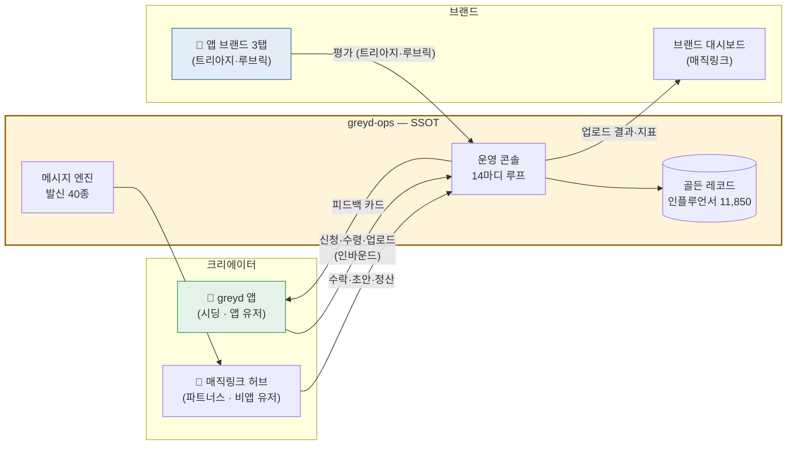

> 충돌 시 ops가 이긴다. 앱·허브·브랜드 화면은 전부 같은 ops 레코드의 투영.

---

## 2. 트랙 계층 — "체험"과 applyMode의 위치 (I1)

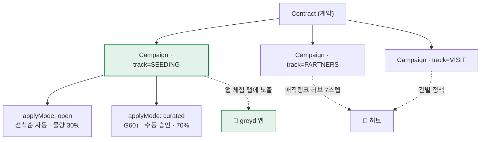

> "트랙"은 ops 예약어(상품 유형). 앱의 Open/Curated는 트랙이 아니라 **SEEDING 캠페인의 신청 유형(applyMode)**.

---

## 3. 상태머신 매핑 — 앱 8값 ↔ ops (I3)

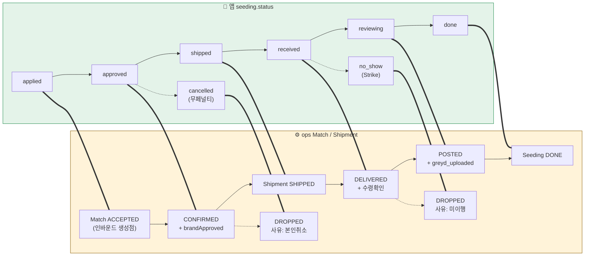

> 앱 인바운드 신청은 ops에 Match를 **ACCEPTED로 생성**한다 — 크리에이터 의사가 이미 확보돼 섭외(OUTREACH·D3/D7 팔로업)를 통째로 생략. 이것이 앱의 존재 이유 중 하나.

---

## 4. 검증 루프 전체 시퀀스 — 세 시스템이 맞물리는 순서

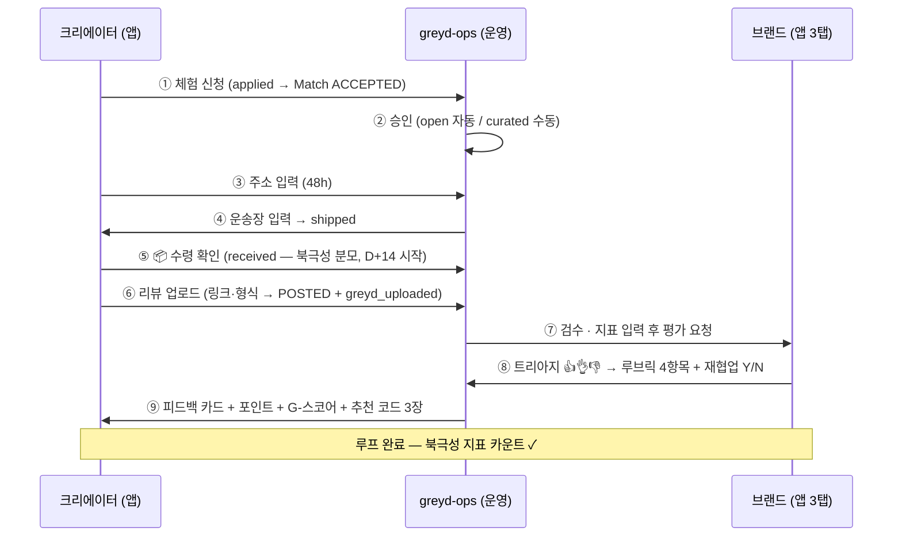

---

## 5. 데이터 연결 — ID · 보상 · 평가의 흐름 (I4 · I6 · I7 · I8)

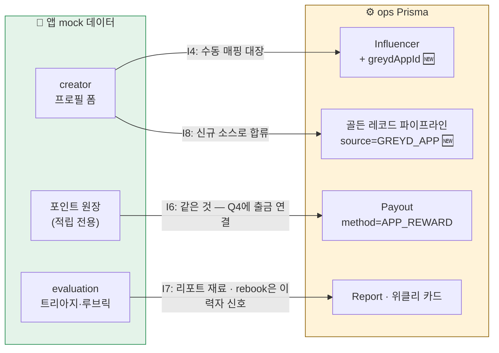

---

## 6. Phase 1 통합 스코프 — 실제로 연결하는 것 (I10)

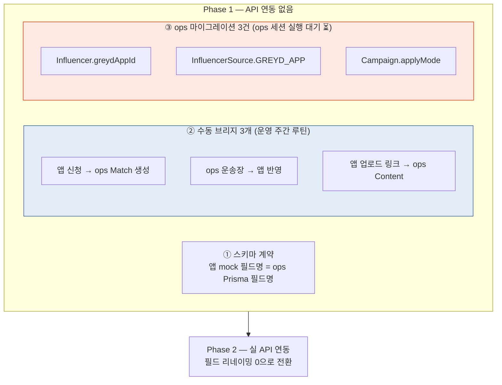

---

---

# 실연동 아키텍처 (Phase 1.5 제안 — 수동 브리지 제거)

앱을 greyd-ops에 직접 연결하는 구조. 핵심: **ops의 기존 인프라(Vercel API·매직링크 토큰·상태머신 엔진)를 그대로 재사용**하고, 앱은 "4번째 표면"으로 붙는다.

## 7. 전체 아키텍처 — 무엇이 어디에 붙는가

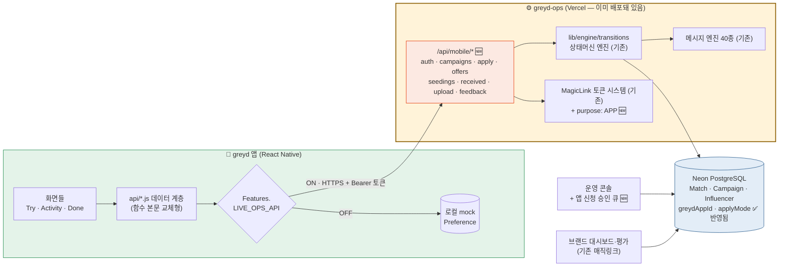

> 🆕 = 새로 만드는 것 (API 라우트 6개 + 토큰 purpose 1개 + 콘솔 큐 1화면). 나머지는 전부 기존 재사용.

## 8. 인증 — 초대 코드가 곧 계정 연동

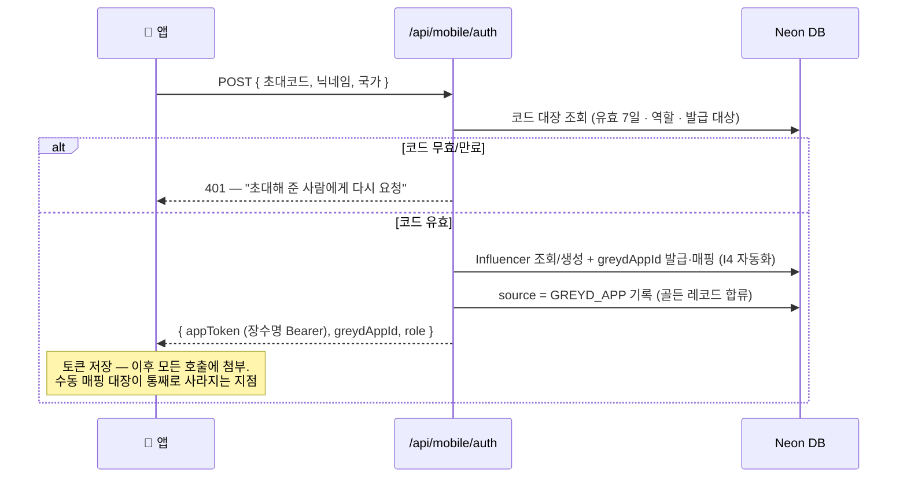

## 9. 검증 루프 실연동 — 수동 브리지 3개가 사라지는 흐름

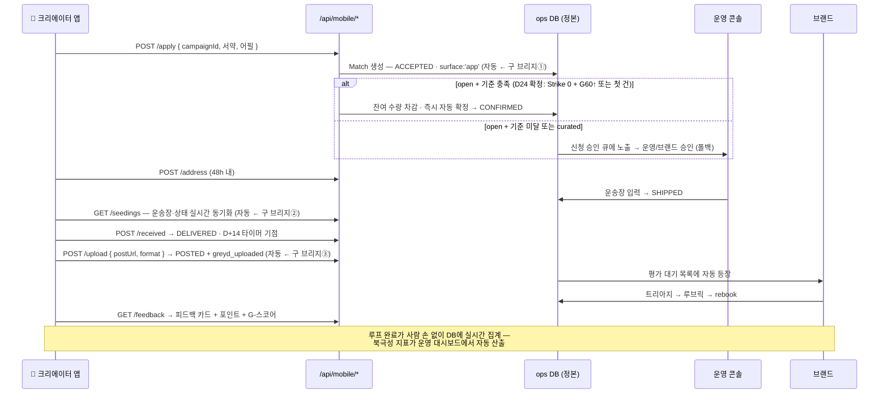

## 9-2. 시딩 유입 이원화 — 신청형 + 제안형 (I11 · D25)

앱은 신청형만이 아니다. ops의 기존 방식(조건 부합 인플루언서에게 먼저 제안)이 앱 유저에게는 **앱 제안 카드**로 전달된다.

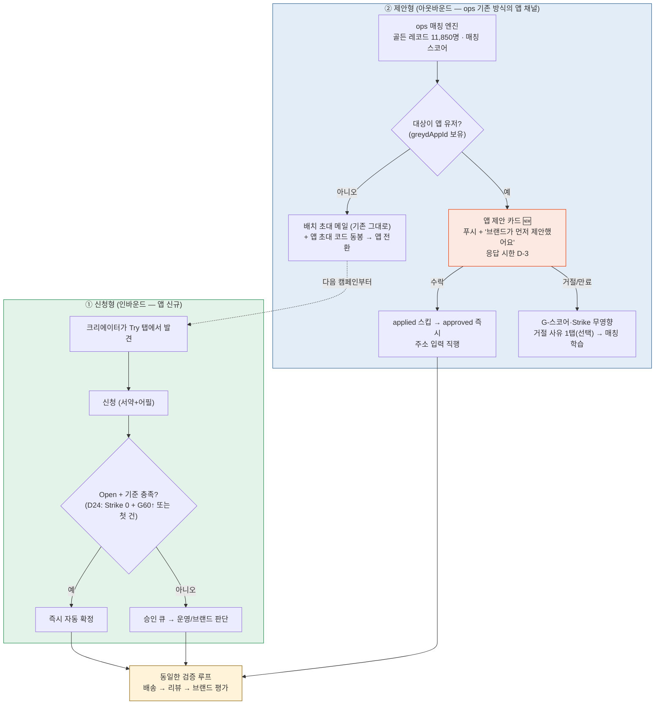

> 제안형 규칙: 동시 한도 초과 유저에게는 제안 노출 자체를 보류(ops 후보 선정 필터). 매칭 조건은 ops가 정본, 앱은 표시만. Phase 1은 수동 브리지(운영이 주간 반영), 실연동 시 `GET/POST /api/mobile/offers`.

## 10. 롤아웃 3단 증분 + 폴백 — 언제든 mock으로 복귀 가능

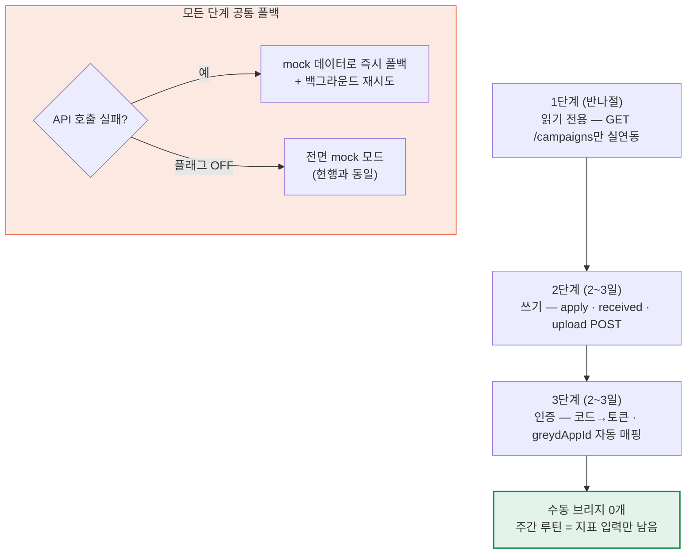

**전제 조건 체크리스트**: ① 스키마 3건 — ✅ 완료(b428d67) ② API 라우트 6개 — ops 세션 작업 ③ 콘솔 신청 큐 — ops 세션 작업 ④ 앱 fetch 교체 + LIVE_OPS_API 플래그 — 앱 세션 작업 ⑤ rate limit·토큰 만료 정책 — 설계 시 확정

---

## 결정 대기 (양측 합의 필요) — 1번은 확정됨

| # | 쟁점 | 상태 |
|---|---|---|
| 1 | ~~시딩 Open 자동 승인 vs 브랜드 승인보드~~ | ✅ **확정 (2026-08-10 · D24)** — Strike 0 + (G60↑ 또는 첫 건) 충족 시 자동 확정, 미충족 시 승인 큐 폴백. 브랜드는 개설 시 사전 위임 |
| 2 | G-스코어를 ops 매칭 스코어 입력으로 쓸지 | 2단계 논의 |
| 3 | 배치 초대 메일 + 앱 초대 코드 동봉(성장 루프) 시작 시점 | Phase 1 후반, 첫 루프 완료 사례 확보 후 |
| 4 | greydAppId 매핑 UI 위치 | ops 초대 코드 관리 화면에 통합 |
